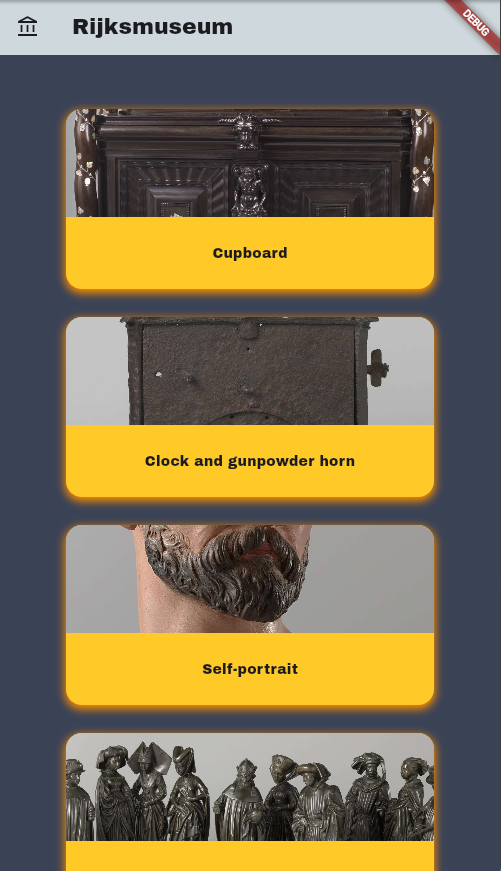
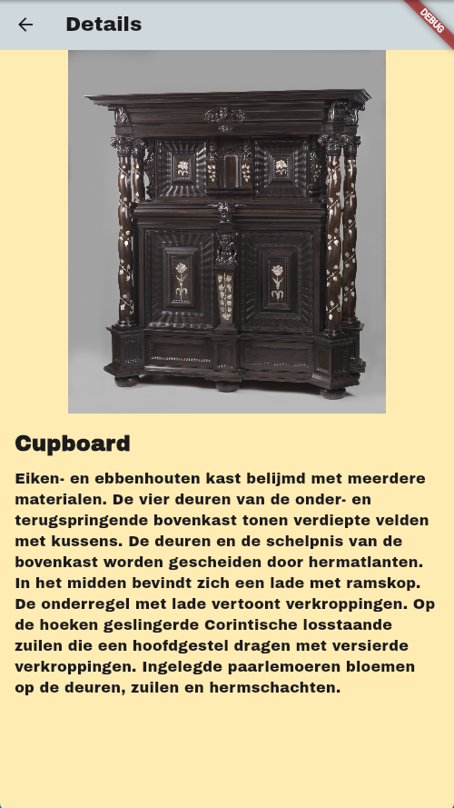

# Flutter Scroll App

Prototype App for endless scrolling.

## Overview

Crafted with the goal of successfully navigating developer job interviews.
Current dataset provided by [Rijksmuseum](https://rijksmuseum.nl)

## Features

- Infinite loading of items (until datasource limit is reached)
- Tapping a list item will open a details screen
- Image have fallback animation

## Screenshots

## Planned improvements

1. [ ] Add cloud features (Firebase)
2. [ ] Enable custom lint
3. [ ] Impove routing on web, allowing to navigate consistently using the address bar
4. [x] Add golden tests
5. [ ] Create beautiful error screen
6. [ ] Create common golden test wrapper
7. [ ] Add localization support
8. [ ] Custom image provider for better loading experience

## Installation

1. Clone this repository.
2. Navigate to the project directory.
3. Run `flutter pub get` to install dependencies.
4. Make sure that you have an API key for data.rijksmuseum.nl
5. Connect your device/emulator and run `flutter run` and provide your API key using `--dart-define=MUSEUM_KEY=$your_key_here`.

## Contributing

If you'd like to contribute to this project, follow these steps:

1. Fork this repository.
2. Create a new branch (`git checkout -b feature/your-feature`).
3. Make your changes.
4. Commit your changes (`git commit -am 'Add some feature'`).
5. Push to the branch (`git push origin feature/your-feature`).
6. Create a new Pull Request.

## Credits

[Flutter](https://docs.flutter.dev/) documentation.

Flutter Bloc [docs](https://bloclibrary.dev/).
